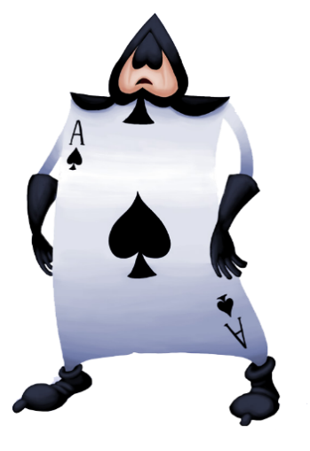
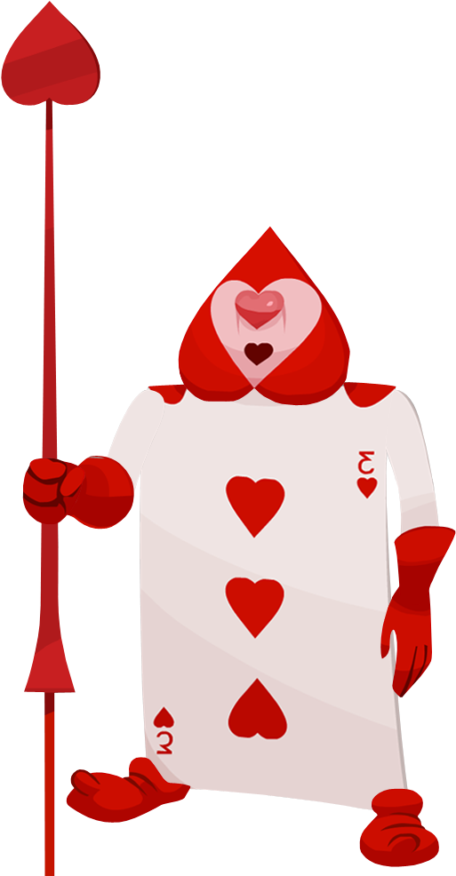

<!--
  The two install badges read one asset by POSITION in the release's asset
  list, which the API returns alphabetically: [1] is the .exe and [2] is the
  .dmg while the five files are named joker-kards-<v>-arm64-mac.zip,
  joker-kards-<v>-setup.exe, joker-kards-<v>.dmg, latest-mac.yml, latest.yml.
  Shields cannot filter by name without printing the pattern next to the
  number. docs/release-runbook.md (private repo) checks the order after every
  publish; if a sixth asset ever joins, re-check the indexes.
-->

&nbsp;&nbsp;

&nbsp;&nbsp;

# Joker Kards

**The scoreboard for game night.** Rummy, Sevens, Knock Rummy, Carrom, a freeform
score pad and a Ticket to Ride card — scored on the table, kept for good.

### [⬇&nbsp; Download the latest build](../../releases/latest)

Builds only. The source lives elsewhere and is private.

---

## What it does

|  | |
|---|---|
| 🃏 **Six games, their own rules** | Rummy and Knock Rummy on the out-line, Sevens over seven hands, Carrom to a target, a score pad for anything else, and an itemised Ticket to Ride card |
| ⌨️ **Built for one scorer** | A number pad that takes `D`, `S`, `S40` and points, Tab and Enter all the way through a hand, and a rule-aware refusal instead of a wrong score |
| 🎙️ **"JK, Bini eighty"** | A command bar on every page, and an optional voice add-on that listens for its own name. Everything it hears is understood and answered on your own computer |
| ⏱️ **A timer for slow turns** | Set it per game; it chimes, says whose time is up, and starts again. Nothing is recorded and nobody is penalised |
| 📊 **Stats that remember** | Streaks, records, a wall of shame, each player's nemesis, and a night recap worth sending to the family chat |
| 🂡 **Deal it to everyone's phones** | Play Rummy with a hand on each person's own phone — one board for the table, from a link, with nothing to install. Pause the game, swap somebody in mid-hand, or hand the table to another person |
| 🃟 **The Joker, if you want him** | Optional AI: he heckles the table as you score, writes the night up afterwards, and answers questions about your own scorebook ("who wins the most?"). The app works out every number itself and the model only puts it into words — so it cannot invent a score, and everything still works with AI switched off |
| 📺 **The table can watch** | A TV overlay for the room, and a phone scoreboard over your own wi-fi while the game runs |
| 💾 **Your games stay yours** | One database on your own computer — no accounts, nothing to sign in to — with crash-safe autosave, a backup before every change, and a doctor that replays every game to prove the numbers. The only thing that ever leaves is an online table: those hands pass through a small server so the phones can reach each other. The AI is off until you turn it on, and can run on a model on your own machine |

## Installing

Download from **[Releases](../../releases/latest)**, then:

<table>
<tr><td width="50%" valign="top">

**macOS** — `joker-kards-*.dmg`

Open the DMG, drag **Joker Kards** to Applications.

The app is signed but not notarized, so the first launch says macOS
*"cannot verify"* — **right-click the app → Open**, once. After that it opens
normally.

</td><td width="50%" valign="top">

**Windows** — `joker-kards-*-setup.exe`

Run it. SmartScreen will warn about an unknown publisher —
**More info → Run anyway**.

Installs for you only, with a desktop shortcut. No admin rights needed.

</td></tr>
</table>

## Updates

The app checks here once per launch and offers what it finds. Nothing downloads
until you say yes, nothing installs until the download is verified against the
checksum published beside it, and the build you were using is kept until the new
one has started and opened your games. If it ever does not, put the old one back
from the Trash.

Made for one family's game nights · not affiliated with any game's publisher · Ticket to Ride is a trademark of Days of Wonder

